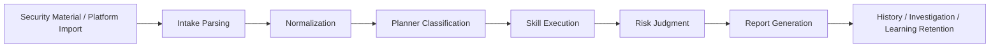

# MegaETH AI Security Platform
<!-- security-log-analysis mainline -->

## 中文

### 1. 项目定位

MegaETH AI Security Platform 是一套面向 **安全日志分析** 的本地化分析工作台。系统接收安全材料，完成归一化与分类，调用对应 Skill，生成中文安全报告，并将结果沉淀为历史记录、调查会话与学习反馈。

当前仓库只承载一个产品域：

- 安全日志分析

任何新的功能开发、样本训练、报告优化和文档更新，都必须围绕这一条主线推进。

### 2. 核心能力

当前主线能力覆盖以下五类工作：

- 统一输入：文件上传、文本输入、平台导入
- 归一化与分类：将原始材料转换为统一事件模型
- Skill 路由与执行：根据事件类型选择对应分析能力
- 中文报告输出：生成面向审计和复核的安全报告
- 学习沉淀：保留调查历史、训练案例和学习反馈

已经落地的重点分析域包括：

- Host baseline 与主机基线合规分析
- Endpoint 进程异常与安全平台事件分析
- JumpServer 单文件与多源审计分析
- Whitebox AppSec 三段式分析
- EASM 单样本与多样本综合分析
- Cloud、Identity、Key、CI/CD 相关能力

### 3. 系统概览

系统当前是一套本地优先、安全日志分析导向的工作台。它的目标不是做自动处置，而是把安全材料稳定地变成：

- 可复核的结构化判断
- 可下载的审计报告
- 可持续校准的训练资产

核心设计原则包括：

- 单一产品域：只做安全日志分析
- 规则主链优先：事实提取、分类和结构由系统控制
- 受控增强：只在允许的段落接入模型增强
- 样本驱动迭代：通过真实样本和目标输出持续校准

### 4. 架构图


### 5. 运行方式

#### 5.1 本地启动

```bash
git clone https://github.com/edmund-xl/MegaETH-AI-Security.git
cd MegaETH-AI-Security
python3 -m venv .venv
source .venv/bin/activate
pip install -r requirements.txt
./start.sh
```

默认访问地址：

- [http://127.0.0.1:8011](http://127.0.0.1:8011)

#### 5.2 健康检查

```bash
curl http://127.0.0.1:8011/health
```

预期返回：

```json
{"status":"ok"}
```

#### 5.3 停止服务

```bash
PORT=8011 ./stop.sh
```

### 6. 页面结构

当前前端固定为五个工作页面：

- `概览`：平台总览、近期报告、关键状态
- `输入`：统一输入、文件上传、归一化后分析
- `技能`：能力目录、模块分布、训练情况
- `连接`：外部平台接入与导入入口
- `学习`：学习反馈与长期校准结果

### 7. 当前分析域

当前已经稳定落地的分析域包括：

- Host baseline
- Endpoint 平台事件
- JumpServer 单文件与多源审计
- Whitebox AppSec 三段式分析
- EASM 单样本分析
- EASM 多样本综合分析

### 8. 核心处理链路

```text
原始安全材料 / 外部平台数据
-> 输入解析
-> 归一化
-> Planner 分类
-> Skill 执行
-> 风险判断
-> 报告生成
-> 历史 / 调查 / 学习沉淀
```

### 9. 目录结构

```text
megaeth-ai-security-rebuild/
├── app/                 # FastAPI 服务、核心分析链、静态前端
├── docs/                # 正式项目文档
├── scripts/             # 启停、发布、备份、自启动脚本
├── skill_specs/         # Skill 规格说明
├── training_cases/      # 训练案例与模板
├── tests/               # 回归测试
├── data/                # 本地运行数据
├── README.md
├── CHANGELOG.md
└── VERSION
```

### 10. 文档导航

- [系统设计](docs/SYSTEM_DESIGN.md)
- [架构说明](docs/architecture.md)
- [功能快照](docs/FEATURE_SNAPSHOT.md)
- [Skill 能力库](docs/SKILL_LIBRARY.md)
- [案例库](docs/CASE_LIBRARY.md)
- [训练流程](docs/TRAINING_WORKFLOW.md)
- [运行手册](docs/runbook.md)
- [交接文档](docs/HANDOFF.md)

### 11. 开发要求

每次有效改动至少应同步以下四层：

- 代码
- 测试
- 文档
- GitHub 主线

如果使用真实样本继续训练系统，建议同时提供：

- 原始材料
- 目标输出示例
- 分类边界要求
- 报告结构要求

### 12. 维护边界

本仓库当前不承载其他产品线或实验控制面。若未来需要扩展新的域，应先完成架构评审、文档增补和产品边界确认，再进入实现阶段。

## English

### 1. Project Positioning

MegaETH AI Security Platform is a local-first workbench for **security log analysis**. The platform ingests security materials, normalizes and classifies them, routes them through the correct Skills, generates Chinese security reports, and retains history, investigations, and learning feedback.

This repository now serves only one product surface:

- Security Log Analysis

All future feature work, sample training, report tuning, and documentation updates must stay within this mainline.

### 2. Core Capabilities

The current mainline covers five core areas:

- Unified intake: file upload, text input, and platform import
- Normalization and classification into a common event model
- Skill routing and execution based on event type
- Chinese report generation for analyst review
- Learning retention through history, cases, and feedback

Implemented analysis domains include:

- Host baseline and host compliance analysis
- Endpoint anomaly and security-platform event analysis
- JumpServer single-source and multi-source audit analysis
- Whitebox AppSec three-stage analysis
- EASM single-source and composite analysis
- Cloud, Identity, Key, and CI/CD capabilities

### 3. System Overview

The current system is a local-first workbench dedicated to security log analysis. It is not an auto-remediation platform; instead, it turns security material into:

- reviewable structured judgments
- downloadable audit reports
- continuously calibratable training assets

Core design principles include:

- single product surface: security log analysis only
- rule-first pipeline: facts, classification, and structure stay system-owned
- controlled augmentation: models only enhance explicitly allowed sections
- sample-driven iteration: real samples and target outputs drive calibration

### 4. Architecture Diagram



### 5. Runtime

#### 5.1 Local Startup

```bash
git clone https://github.com/edmund-xl/MegaETH-AI-Security.git
cd MegaETH-AI-Security
python3 -m venv .venv
source .venv/bin/activate
pip install -r requirements.txt
./start.sh
```

Default URL:

- [http://127.0.0.1:8011](http://127.0.0.1:8011)

#### 5.2 Health Check

```bash
curl http://127.0.0.1:8011/health
```

Expected response:

```json
{"status":"ok"}
```

#### 5.3 Stop Service

```bash
PORT=8011 ./stop.sh
```

### 6. UI Structure

The active frontend is limited to five pages:

- `概览` for platform overview and recent reports
- `输入` for unified intake and analysis trigger
- `技能` for the capability catalog
- `连接` for integration entry points
- `学习` for learning feedback and retained corrections

### 7. Current Analysis Domains

The currently landed analysis domains include:

- Host baseline
- Endpoint platform events
- JumpServer single-source and multi-source auditing
- Whitebox AppSec three-stage analysis
- EASM single-source analysis
- EASM composite multi-file analysis

### 8. Core Processing Flow

```text
Raw security material / external platform data
-> intake parsing
-> normalization
-> Planner classification
-> Skill execution
-> risk judgment
-> report generation
-> history / investigation / learning retention
```

### 9. Repository Structure

```text
megaeth-ai-security-rebuild/
├── app/                 # FastAPI service, core pipeline, static UI
├── docs/                # formal project documentation
├── scripts/             # start/stop/release/backup/launch scripts
├── skill_specs/         # Skill specifications
├── training_cases/      # training cases and templates
├── tests/               # regression tests
├── data/                # local runtime data
├── README.md
├── CHANGELOG.md
└── VERSION
```

### 10. Document Map

- [System Design](docs/SYSTEM_DESIGN.md)
- [Architecture](docs/architecture.md)
- [Feature Snapshot](docs/FEATURE_SNAPSHOT.md)
- [Skill Library](docs/SKILL_LIBRARY.md)
- [Case Library](docs/CASE_LIBRARY.md)
- [Training Workflow](docs/TRAINING_WORKFLOW.md)
- [Runbook](docs/runbook.md)
- [Handoff Guide](docs/HANDOFF.md)

### 11. Delivery Requirements

Every meaningful change must synchronize four layers:

- code
- tests
- documentation
- GitHub mainline

When using real samples for training, provide:

- raw materials
- target output examples
- classification boundaries
- report-structure expectations

### 9. Maintenance Boundary

This repository does not host any secondary product line or experimental control plane. Any future expansion must start with architecture review, documentation updates, and explicit scope confirmation.
