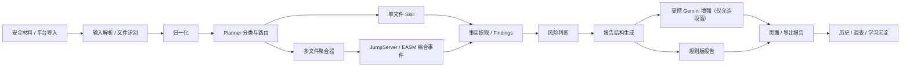
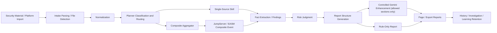

# MegaETH AI Security Platform
<!-- security-log-analysis mainline -->

## 中文

### 1. 项目简介

MegaETH AI Security Platform 是一套围绕 **安全日志分析** 构建的本地优先分析工作台。它接收真实安全材料，完成归一化、分类、Skill 路由、风险判断和报告生成，并把结果沉淀到历史、调查会话与学习反馈中。

当前仓库只承载一个产品域：

- 安全日志分析

本仓库不再承载其他产品线或实验控制面。任何新功能、新样本训练、新文档和新页面，都必须围绕这一条主线推进。

### 2. 目标与非目标

#### 2.1 项目目标

当前主线的目标是把安全材料稳定转换成三类结果：

- 可复核的结构化判断
- 可导出的中文安全报告
- 可持续校准的训练资产

#### 2.2 非目标

当前系统不是：

- 自动攻击平台
- 自动处置中心
- 大规模分布式任务编排系统
- 多租户 SaaS 平台

### 3. 核心能力

系统目前围绕以下能力运作：

- 统一输入
  - 文件上传
  - 文本输入
  - 平台导入
- 归一化与分类
  - 原始材料解析
  - 统一事件模型生成
  - Planner 事件分类与 Skill 路由
- 分析与判断
  - 规则主链执行
  - 受控模型增强
  - 风险标签与综合判断
- 报告输出
  - 页面报告
  - Markdown 导出
  - 历史报告回看
- 学习沉淀
  - 调查记录
  - 训练案例
  - 学习反馈

### 4. 当前已落地分析域

当前主线已稳定落地以下分析域：

- Host baseline 与主机基线合规分析
- Endpoint 安全平台事件分析
- JumpServer 单文件与多源审计分析
- Whitebox AppSec 三段式分析
- EASM 单样本分析
- EASM 多样本综合分析
- Cloud、Identity、Key Security、CI/CD 相关能力

EASM 当前不是能力骨架，而是已经支持：

- 单文件独立分析
- 多文件综合分析
- `easm_asset_assessment` 综合结果生成
- 综合报告的 `assessment / professional_judgment` 由 Gemini 受控增强

### 5. 系统架构概览



系统的基本原则是：

- 事实提取、分类与结构由系统控制
- 模型只增强允许增强的段落
- 页面输出与导出报告必须保持结构一致
- 真实样本训练必须同步更新文档和 GitHub

其中需要特别注意：

- 单文件材料通常直接路由到对应 Skill
- JumpServer、EASM 这类多文件输入会先聚合，再形成综合事件
- Gemini 只增强综合结论、专业判断等允许增强的段落

### 6. 主要运行路径

标准运行路径如下：

```text
原始安全材料 / 外部平台数据
-> 输入解析
-> 归一化
-> Planner 分类
-> 单文件 Skill 或多文件聚合
-> Skill 执行 / 综合事件生成
-> 风险判断
-> 报告结构生成
-> 受控模型增强（可选）
-> 历史 / 调查 / 学习沉淀
```

这条链是当前仓库最重要的工程主线。任何能力扩展，都必须明确自己位于这条链路中的哪个节点。

### 7. 前端工作台

当前前端固定为五页工作台：

- `概览`
  - 平台当前状态、近期报告、能力覆盖概览
- `输入`
  - 文件上传、文本输入、统一分析入口
- `技能`
  - Skill 目录、模块分布、训练覆盖
- `连接`
  - 外部平台接入与导入入口
- `学习`
  - 学习反馈与训练沉淀

共享前端逻辑的任何改动，都必须回归验证这五个页面。

### 8. 本地运行

#### 8.1 环境准备

```bash
git clone https://github.com/edmund-xl/MegaETH-AI-Security.git
cd MegaETH-AI-Security
python3 -m venv .venv
source .venv/bin/activate
pip install -r requirements.txt
```

#### 8.2 启动

```bash
./start.sh
```

默认访问地址：

- [http://127.0.0.1:8011](http://127.0.0.1:8011)

#### 8.3 健康检查

```bash
curl http://127.0.0.1:8011/health
```

预期返回：

```json
{"status":"ok"}
```

#### 8.4 停止服务

```bash
PORT=8011 ./stop.sh
```

### 9. 性能与长期运行说明

当前系统仍然是本地优先、JSON 文件驱动的实现，但已经做了几层明确的性能约束，避免随着历史数据增长自然退化：

- 历史主数据文件带数量上限和保留窗口
- `/history` 只返回摘要，不再把完整历史数组传给前端
- JSON 读取带进程内缓存，未变化文件不会被重复解析
- Skill 训练案例索引带缓存，避免反复全量扫描 `training_cases/`
- 学习页不再为已删除的“学习规则”面板发起无意义请求

这意味着当前系统适合长期作为本地分析工作台持续运行。需要明确的是，当前稳定性来自“文件驱动 + 有界历史 + 摘要接口 + 轻缓存”的组合，而不是来自数据库级无限扩展能力。

如果后续样本量、报告量或历史保留要求显著上升，下一步应优先升级：

- `reports / history / memory` 的持久化层
- 列表与详情分离的接口模型
- 更适合持续增长的数据库存储

### 10. 目录结构

```text
MegaETH-AI-Security/
├── app/                 # FastAPI 服务、核心分析链、前端静态资源
├── data/                # 本地运行数据与归档
├── docs/                # 正式工程文档
├── scripts/             # 启停、守护、备份、发布脚本
├── skill_specs/         # Skill 规格文档
├── tests/               # 回归测试
├── training_cases/      # 训练案例与模板
├── CHANGELOG.md
├── README.md
├── VERSION
└── requirements.txt
```

### 11. 文档导航

核心文档入口如下：

- [系统设计](docs/SYSTEM_DESIGN.md)
- [架构说明](docs/architecture.md)
- [功能快照](docs/FEATURE_SNAPSHOT.md)
- [Skill 能力库](docs/SKILL_LIBRARY.md)
- [案例库](docs/CASE_LIBRARY.md)
- [训练工作流](docs/TRAINING_WORKFLOW.md)
- [运行手册](docs/runbook.md)
- [当前状态](docs/STATUS.md)
- [交接文档](docs/HANDOFF.md)
- [CI/CD 日志采集规范](docs/CICD_LOG_COLLECTION_SPEC.md)

### 12. 开发与变更要求

每次有效能力变更，至少必须同步以下内容：

- 代码
- 测试
- 文档
- GitHub 主线或当前开发分支

如果是样本驱动训练，还应同步提供：

- 原始样本
- 目标输出示例
- 分类边界要求
- 报告结构要求

### 13. 维护边界

后续维护必须遵守以下边界：

- 不新增第二产品域
- 不跨项目污染当前运行历史
- 大文件处理不能只验证“读出来”，必须验证聚合和输出
- 页面输出与导出报告必须一起验证
- 改共享层时必须验证五个页面

---

## English

### 1. Project Overview

MegaETH AI Security Platform is a local-first workbench dedicated to **security log analysis**. It ingests real security materials, normalizes and classifies them, routes them through Skills, generates reports, and retains results through history, investigations, and learning feedback.

The repository now serves only one product surface:

- Security Log Analysis

No other product line or experimental control plane is carried in this repository anymore.

### 2. Goals and Non-Goals

#### 2.1 Goals

The current mainline is designed to turn security materials into:

- reviewable structured judgments
- exportable Chinese security reports
- reusable training assets for continuous calibration

#### 2.2 Non-Goals

The current system is not:

- an automated attack platform
- an auto-remediation center
- a large-scale distributed orchestration system
- a multi-tenant SaaS platform

### 3. Core Capabilities

The platform currently provides:

- unified intake
  - file upload
  - text input
  - platform import
- normalization and classification
  - raw material parsing
  - common event model generation
  - Planner-based event classification and Skill routing
- analysis and judgment
  - rule-first execution
  - controlled model augmentation
  - risk tagging and synthesized judgment
- reporting
  - in-page reports
  - Markdown export
  - historical report review
- learning retention
  - investigation records
  - training cases
  - learning feedback

### 4. Implemented Analysis Domains

The current mainline includes:

- Host baseline and host compliance analysis
- Endpoint security-platform event analysis
- JumpServer single-source and multi-source audit analysis
- Whitebox AppSec three-stage analysis
- EASM single-source analysis
- EASM composite multi-file analysis
- Cloud, Identity, Key Security, and CI/CD-related capabilities

EASM is already beyond a scaffold stage. It currently supports:

- standalone single-file analysis
- composite multi-file analysis
- generation of `easm_asset_assessment`
- Gemini-enhanced composite `assessment` and `professional_judgment`

### 5. Architecture Overview



Key design principles:

- facts, classification, and structure remain system-owned
- models only enhance explicitly allowed sections
- page output and exported reports must stay structurally aligned
- real-sample training must update docs and GitHub together

Pay special attention to the following:

- single-file material usually routes directly to the matching Skill
- JumpServer and EASM multi-file batches pass through an aggregator and become composite events
- Gemini only enhances explicitly permitted sections such as composite conclusion and professional judgment

### 6. Primary Runtime Path

```text
raw security material / platform data
-> intake parsing
-> normalization
-> Planner classification
-> single-source Skill or composite aggregation
-> Skill execution / composite event generation
-> risk judgment
-> report structure generation
-> controlled model enhancement (optional)
-> history / investigation / learning retention
```

This is the most important engineering path in the repository.

### 7. Frontend Workbench

The frontend is a fixed five-page workbench:

- `Overview`
- `Intake`
- `Skills`
- `Integrations`
- `Learning`

Any shared frontend change must be regressed against all five pages.

### 8. Local Runtime

#### 8.1 Setup

```bash
git clone https://github.com/edmund-xl/MegaETH-AI-Security.git
cd MegaETH-AI-Security
python3 -m venv .venv
source .venv/bin/activate
pip install -r requirements.txt
```

#### 8.2 Start

```bash
./start.sh
```

Default URL:

- [http://127.0.0.1:8011](http://127.0.0.1:8011)

#### 8.3 Health Check

```bash
curl http://127.0.0.1:8011/health
```

Expected response:

```json
{"status":"ok"}
```

#### 8.4 Stop

```bash
PORT=8011 ./stop.sh
```

### 9. Performance and Long-Running Behavior

The current system is still a local-first, JSON-backed implementation, but it already applies explicit performance constraints so the runtime does not naturally degrade as history grows:

- history data files have bounded retention and record caps
- `/history` returns summary data instead of full history arrays
- JSON reads use in-process caching so unchanged files are not repeatedly parsed
- Skill training-case indexing is cached to avoid rescanning `training_cases/` on each overview or skills request
- the learning view no longer issues pointless requests for the removed rules panel

This means the current system is suitable for sustained local use as an analysis workbench. The stability comes from bounded file-backed storage, summary-oriented endpoints, and lightweight caches rather than from unbounded database-scale architecture.

If sample volume, report volume, or retention requirements grow materially, the next upgrades should prioritize:

- persistent storage for `reports / history / memory`
- separating summary and detail API shapes
- database-backed storage designed for steady growth

### 10. Repository Structure

```text
MegaETH-AI-Security/
├── app/                 # FastAPI service, analysis pipeline, frontend assets
├── data/                # local runtime data and archives
├── docs/                # formal engineering documentation
├── scripts/             # start/stop, watchdog, backup, release scripts
├── skill_specs/         # Skill specification documents
├── tests/               # regression tests
├── training_cases/      # training cases and templates
├── CHANGELOG.md
├── README.md
├── VERSION
└── requirements.txt
```

### 11. Documentation Index

- [System Design](docs/SYSTEM_DESIGN.md)
- [Architecture](docs/architecture.md)
- [Feature Snapshot](docs/FEATURE_SNAPSHOT.md)
- [Skill Library](docs/SKILL_LIBRARY.md)
- [Case Library](docs/CASE_LIBRARY.md)
- [Training Workflow](docs/TRAINING_WORKFLOW.md)
- [Runbook](docs/runbook.md)
- [Status](docs/STATUS.md)
- [Handoff](docs/HANDOFF.md)
- [CI/CD Log Collection Specification](docs/CICD_LOG_COLLECTION_SPEC.md)

### 12. Development Rules

Every meaningful capability change must update:

- code
- tests
- docs
- GitHub mainline or the active development branch

Sample-driven training should ideally include:

- raw samples
- target outputs
- classification boundaries
- report-structure expectations

### 13. Maintenance Boundaries

Ongoing maintenance must preserve these boundaries:

- no second product surface
- no cross-project sample pollution in runtime history
- large-file support must validate aggregation and output, not just parsing
- page output and export output must be verified together
- shared-layer changes must be regressed across all five pages
