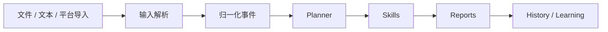
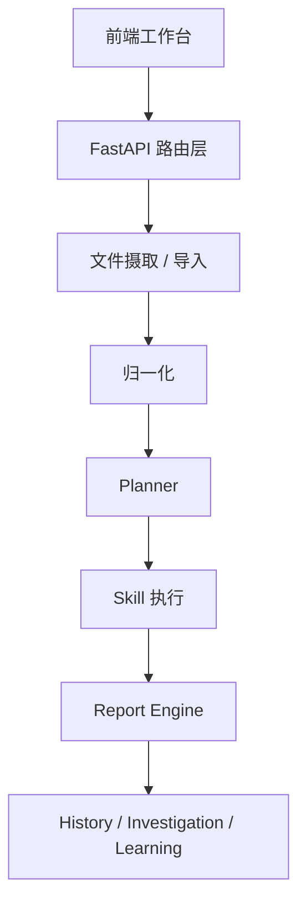

# 架构说明
<!-- security-log-analysis mainline -->

## 中文

### 1. 文档目的

本文档从结构视角解释系统如何工作，重点帮助开发、维护、测试和交接快速理解：

- 前后端如何配合
- 主要运行路径如何串接
- 核心模块之间如何依赖
- 哪些边界不能被跨越

### 2. 系统上下文

当前系统接收两类主要输入：

- 本地安全材料
- 平台导入结果

这些输入统一进入同一条分析链，并最终产生：

- Findings
- 安全报告
- 调查记录
- 学习反馈

系统上下文可以简化为：



### 3. 前端架构

前端当前是单一静态工作台，由后端直接提供静态资源。其结构固定为五页：

- `概览`
- `输入`
- `技能`
- `连接`
- `学习`

前端主要职责包括：

- 展示当前平台状态
- 发起上传和分析
- 浏览能力目录和训练覆盖
- 查看历史输出和学习反馈

前端不负责：

- 原始事件分类
- 风险判断
- 报告结构定义

### 4. 后端架构

后端以 FastAPI 为主，包含四类核心部分：

- 路由层
- 核心分析链
- 持久化层
- 静态资源服务

其中最重要的部分是核心分析链，其顺序为：

- ingest
- normalize
- plan
- execute skills
- score risk
- generate reports

### 5. 主要运行路径

最常见的用户到系统运行路径如下：

```text
上传文件 / 文本输入
-> 创建调查批次
-> 文件摄取与识别
-> 归一化
-> Planner 选择事件类型与 Skills
-> Skill 输出 findings
-> 报告生成
-> 历史与学习沉淀
```

### 6. 关键结构关系

可以把当前架构概括为以下关系：

```text
输入源 -> 归一化事件 -> Planner -> Skill -> Findings -> Reports -> History / Learning
```

这些层之间的职责不要混淆：

- 输入层不做最终判断
- 归一化层不负责报告写作
- Planner 不直接导出报告
- Skill 不替代持久化层

### 7. 主要模块图



### 8. 当前分析域在架构中的落点

不同分析域共享同一条架构主链，但 Skill 层内部逻辑不同：

- Host baseline
- Endpoint
- JumpServer
- Whitebox AppSec
- EASM

其中 EASM 当前的落点为：

- 单文件可以独立触发对应 Skill
- 多文件会附加生成 `easm_asset_assessment`
- 综合结论与专业判断允许 Gemini 增强

### 9. 页面与后端关系

#### 9.1 概览

依赖：

- `/pipeline/overview`
- `/reports/recent`
- `/investigations/recent`
- `/history`

#### 9.2 输入

依赖：

- 上传接口
- 分析触发接口
- 当前调查和报告结果读取

#### 9.3 技能

依赖：

- `/skills`
- 训练覆盖统计

#### 9.4 连接

依赖：

- 平台接入状态
- 导入动作入口

#### 9.5 学习

依赖：

- `/memory/feedback`

### 10. 架构边界

当前必须遵守以下边界：

- 只保留安全日志分析一个产品域
- 共享前端逻辑变更必须回归五个页面
- 不允许跨项目样本污染运行历史
- 大文件处理不能只验证解析成功，还要验证聚合和输出
- 页面与导出结构必须一致

### 11. 当前架构现实

当前架构更接近：

- 本地分析工作台
- 训练驱动能力平台
- 规则与受控模型增强并存的系统

而不是：

- 云原生分布式分析平台
- 多租户 SaaS
- 自动化处置和执行中心

### 12. 结论

当前架构最合适的理解方式是：

- 前端是一套固定的安全日志分析工作台
- 后端是一条围绕样本训练持续迭代的分析链
- Skill 是领域能力边界
- Report Engine 是结构收口层
- History / Learning 是长期校准层

---

## English

### 1. Purpose

This document explains the system from a structural perspective and helps developers, maintainers, testers, and future collaborators understand:

- how frontend and backend fit together
- how the primary runtime path is composed
- how the main modules depend on each other
- which boundaries must not be crossed

### 2. System Context

The system currently ingests two major categories of input:

- local security materials
- platform-imported results

They enter a shared analysis pipeline and eventually produce:

- findings
- security reports
- investigations
- learning feedback

### 3. Frontend Architecture

The frontend is a single static workbench served by the backend. It has five fixed pages:

- `概览`
- `输入`
- `技能`
- `连接`
- `学习`

The frontend is responsible for:

- showing platform state
- triggering upload and analysis
- browsing capability coverage
- reviewing outputs and learning feedback

### 4. Backend Architecture

The backend is centered on FastAPI and includes:

- routes
- the core analysis pipeline
- persistence
- static asset serving

The core analysis pipeline runs in this order:

- ingest
- normalize
- plan
- execute skills
- score risk
- generate reports

### 5. Primary Runtime Path

```text
upload file / text input
-> create investigation batch
-> file ingest and recognition
-> normalization
-> Planner selects event types and Skills
-> Skills produce findings
-> report generation
-> history and learning retention
```

### 6. Key Structural Relationship

```text
input sources -> normalized events -> Planner -> Skills -> findings -> reports -> history / learning
```

Responsibilities must stay separate:

- intake does not make final judgments
- normalization does not author final reports
- Planner does not export reports
- Skills do not replace persistence

### 7. Major Module View

The current architecture can also be summarized as:

- frontend workbench
- FastAPI route layer
- ingest/import layer
- normalization
- Planner
- Skills
- Report Engine
- History / Investigation / Learning

### 8. Analysis-Domain Placement

All domains share the same mainline architecture but differ inside the Skill layer:

- Host baseline
- Endpoint
- JumpServer
- Whitebox AppSec
- EASM

EASM currently supports:

- standalone single-file Skill routing
- composite multi-file `easm_asset_assessment`
- Gemini enhancement for composite judgment sections

### 9. Page-to-Backend Relationship

Each page depends on a different slice of backend state:

- overview
- intake
- skills
- integrations
- learning

### 10. Architectural Boundaries

The current architecture enforces:

- one active product surface only
- five-page regression after shared frontend changes
- no cross-project sample pollution
- large-file validation beyond parse success
- structural consistency between page and export outputs

### 11. Current Reality

The current architecture is much closer to:

- a local analysis workbench
- a training-driven capability platform
- a hybrid of deterministic logic and controlled model augmentation

It is not yet:

- a distributed cloud-native platform
- a multi-tenant SaaS system
- an automated execution center

### 12. Summary

The best way to understand the current architecture is:

- the frontend is a fixed security-log-analysis workbench
- the backend is a sample-driven evolving analysis chain
- Skills are domain boundaries
- the Report Engine is the structural convergence layer
- History and Learning are the long-term calibration layer
