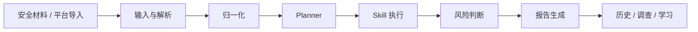
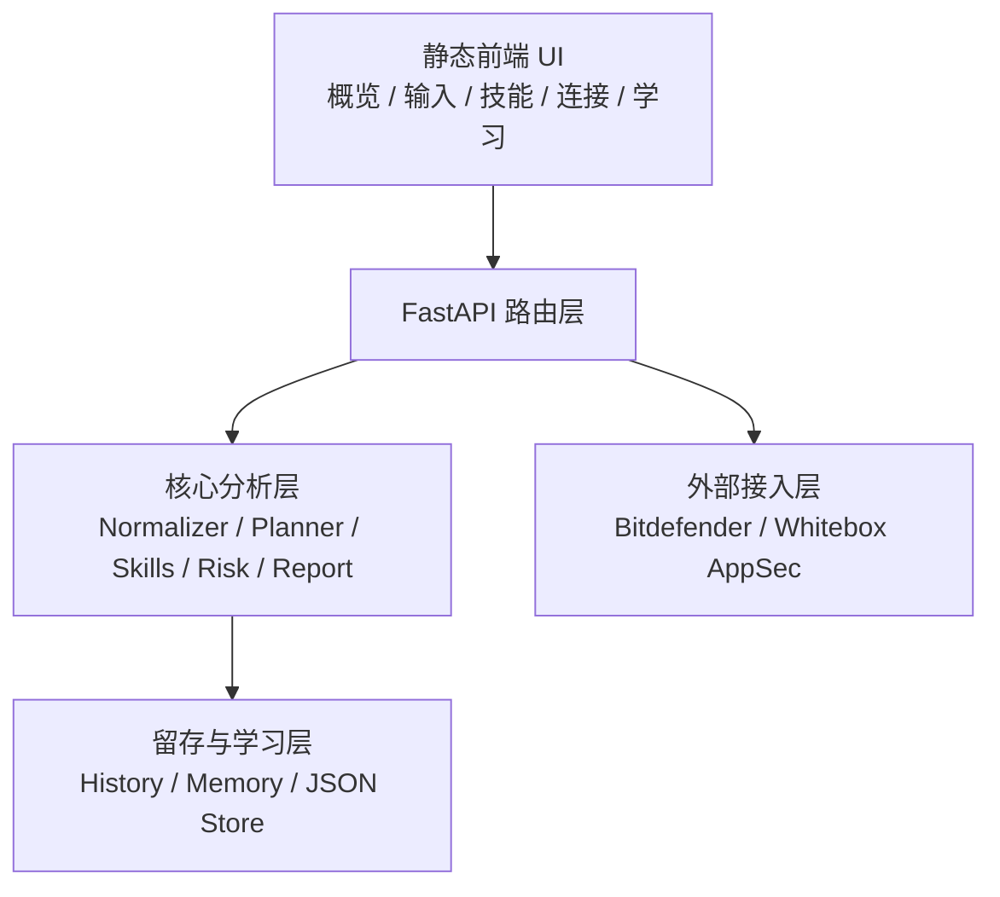

# 架构说明
<!-- security-log-analysis mainline -->

## 1. 目的

本文档提供系统的结构化架构视图，用于帮助开发、测试和交接快速理解当前主线。

## 2. 系统上下文



## 3. 前后端关系



## 4. 运行关键路径

### 4.1 单次分析路径

```text
用户上传材料
-> 输入解析
-> 归一化
-> 分类
-> Skill 执行
-> 生成 Findings
-> 生成安全报告
-> 写入历史与学习反馈
```

### 4.2 平台导入路径

```text
点击连接页导入
-> 平台接口拉取
-> 标准化为统一事件
-> 进入与本地上传相同的分析链
```

## 5. 模块边界

### 5.1 输入与接入层

职责：

- 接收本地文件与文本
- 发起平台导入
- 产生原始输入对象

### 5.2 归一化与分类层

职责：

- 识别材料类型
- 统一字段结构
- 生成 `source_type` 与 `event_type`
- 根据事件类型选择 Skill

### 5.3 执行与报告层

职责：

- 执行 Skill
- 输出 Findings
- 计算风险标签
- 生成安全报告与下载内容

### 5.4 留存与学习层

职责：

- 保存历史报告与调查记录
- 保存学习反馈与规则
- 为后续样本训练提供回写基础

## 6. 运行边界

当前主线必须遵守以下边界：

- 只保留安全日志分析一个产品域
- 不再引入其他顶级产品域
- 修改共享前端文件时必须验证全部五个页面
- 不使用其他项目材料污染当前运行态
